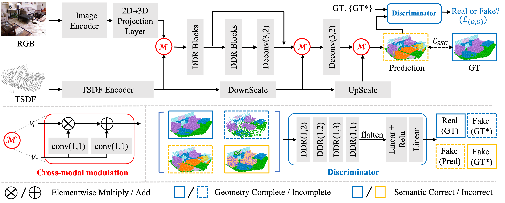
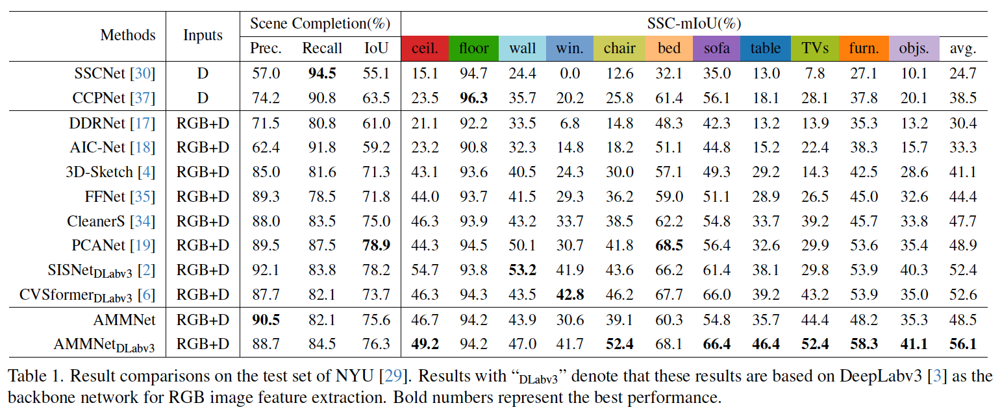
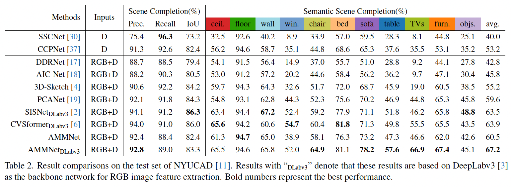

# AMMNet

This repository contains the official PyTorch implementation of the following CVPR 2024 paper:

Title: **Unleashing Network Potentials for Semantic Scene Completion**   [PDF]()

Author: [Fengyun Wang](https://fereenwong.github.io/), [Qianru Sun](https://qianrusun.com/), [Dong Zhang](https://dongzhang89.github.io/), and [Jinhui Tang](https://scholar.google.com/citations?user=ByBLlEwAAAAJ&hl=zh-CN), 

Affiliation: NJUST, SMU, HKUST

## Abstract
<p align="justify">
Semantic scene completion (SSC) aims to predict complete 3D voxel occupancy and semantics from a single-view RGB-D image, and recent SSC methods commonly adopt multi-modal inputs. However, our investigation reveals two limitations: ineffective feature learning from single modalities and overfitting to limited datasets. To address these issues, this paper proposes a novel SSC framework - Adversarial Modality Modulation Network (AMMNet) - with a fresh perspective of optimizing gradient updates. The proposed AMMNet introduces two core modules: a cross-modal modulation enabling the interdependence of gradient flows between modalities, and a customized adversarial training scheme leveraging dynamic gradient competition. Specifically, the cross-modal modulation adaptively re-calibrates the features to better excite representation potentials from each single modality. The adversarial training employs a minimax game of evolving gradients, with customized guidance to strengthen the generator's perception of visual fidelity from both geometric completeness and semantic correctness. Extensive experimental results demonstrate that AMMNet outperforms state-of-the-art SSC methods by a large margin, providing a promising direction for improving the effectiveness and generalization of SSC methods. 

## Overall architecture

<p align="justify">
AMMNet consists of three components: an image encoder for RGB input, a TSDF encoder for TSDF input, and a decoder for final prediction. It has two novel modules: cross-modal modulations after the encoders and decoder to recalibrate features, and a discriminator that distinguishes real/fake voxels to mitigate overfitting issues.

  ## Pre-trained model

The NYU dataset:
| ImageEncoder      |                    Model Zoo                    |                 Visual Results                 |
| :------------------ | :-----------------------------------------------: | :-----------------------------------------------: |
| Segformer-B2     | [Google Drive](https://drive.google.com/file/d/1DJXXA570w0e9mfE_RuGgCGjwBmcOxXUZ/view?usp=drive_link) / [Baidu Netdisk](https://pan.baidu.com/s/1HeZ-IhWR6xAIVgkTAehvyQ?pwd=sovq) with code:sovq | [Google Drive](https://drive.google.com/file/d/1xXdK2Tmefs19ABaRrMeZsWm90-MiGqOX/view?usp=drive_link) / [Baidu Netdisk](https://pan.baidu.com/s/1IMzKICUeHP3ooTKvK22lCQ?pwd=p4e7) with code:p4e7 |
| DeepLabv3 | TODO... | [Google Drive](https://drive.google.com/file/d/1TY_N4UhiieK1MvxFKtwg6_j3NZ8X_7D5/view?usp=sharing) / [Baidu Netdisk](https://pan.baidu.com/s/163G1lTYHfYOkDIX46KQLqg?pwd=0pww) with code:0pww |

The NYUCAD dataset:
| ImageEncoder      |                    Model Zoo                    |                 Visual Results                 |
| :------------------ | :-----------------------------------------------: | :-----------------------------------------------: |
| Segformer-B2     | [Google Drive](https://drive.google.com/file/d/1MEUa8h_b8oIgqFnBDZ6OowxBZwF6qDoO/view?usp=drive_link) / [Baidu Netdisk](https://pan.baidu.com/s/1_HEt2yykZSYLk2kyQtjnzQ?pwd=7mlm) with code:7mlm | [Google Drive](https://drive.google.com/file/d/1UEvgHy6Tr9dtJBvI46ukVO-b6lyyya3H/view?usp=drive_link) / [Baidu Netdisk](https://pan.baidu.com/s/1rnCIhc8gD7S-zhxEvqp_DQ?pwd=1fa9) with code:1fa9 |
| DeepLabv3 | TODO... | [Google Drive](https://drive.google.com/file/d/1QKsCnvKrg4ql-RK9WwesdZb8CIDsjrVq/view?usp=sharing) / [Baidu Netdisk](https://pan.baidu.com/s/1jSsf2WgXJq9mId2aOrbhCQ?pwd=biug) with code:biug |


## Comparisons with SOTA

The NYU dataset


The NYUCAD dataset


## Usage
#### Requirements
- Pytorch 1.10.1
- cudatoolkit 11.1
- mmcv 1.5.0
- mmsegmentation 0.27.0

#### Suggested installation steps:

```angular2html
conda create -n CleanerS python=3.7 -y
conda activate CleanerS
conda install pytorch==1.10.1 torchvision==0.11.2 torchaudio==0.10.1 cudatoolkit=11.1 -c pytorch -c conda-forge
pip install mmcv-full==1.5.0 -f https://download.openmmlab.com/mmcv/dist/cu111/torch1.10/index.html
pip install mmsegmentation==0.27.0
conda install scikit-learn
pip install pyyaml timm tqdm EasyConfig multimethod easydict termcolor shortuuid imageio
```

#### Data preparation

We follow the project of [3D-Sketch](https://github.com/charlesCXK/TorchSSC) for dataset preparation. 

After preparing, the `your_SSC_Dataset` folder should look like this:

````
-- your_SSC_Dataset
   | NYU
   |-- TSDF
   |-- Mapping
   |   |-- trainset
   |   |-- |-- RGB
   |   |-- |-- depth
   |   |-- |-- GT
   |   |-- testset
   |   |-- |-- RGB
   |   |-- |-- depth
   |   |-- |-- GT
   | NYUCAD
   |-- TSDF
   |   |-- trainset
   |   |-- |-- depth
   |   |-- testset
   |   |-- |-- depth
````

#### Training

- **on Segformer-B2**

1. Download the pretrained Segformer-B2, [mit_b2.pth](https://drive.google.com/drive/folders/1b7bwrInTW4VLEm27YawHOAMSMikga2Ia) or our backup copy ([Google Drive](https://drive.google.com/file/d/1_0_Lobki5vZMAgb13kqilVNaQtpC4S4z/view?usp=sharing) / [Baidu Netdisk](https://pan.baidu.com/s/1_07XgprNRwBVi5rXDrJVmw?pwd=8uem) with code:8uem).;
2. Run `run.sh` for training the AMMNet.

- **on DeepLabv3**

1. Download the semantic segmentation results from [CVSformer](https://github.com/donghaotian123/CVSformer) or our backup copy ([Google Drive](https://drive.google.com/file/d/1g3BP0ijR-9Y2H7dTyFiHnuuyQGtUOJJM/view?usp=sharing) / [Baidu Netdisk](https://pan.baidu.com/s/1SNVFxylfI1W2vgZPj9Ztlw?pwd=ulpa) with code:ulpa).
2. For the segmentation results, add one more layer to match the feature channel:
   ```
   self.feature2d_proc = nn.Sequential(
            nn.Conv3d(14, 3, kernel_size=3, padding=1, bias=False),
            norm_layer(3, momentum=bn_momentum),
            nn.ReLU(),
            nn.Conv3d(3, 64, kernel_size=3, padding=1, bias=False),
            norm_layer(64, momentum=bn_momentum),
            nn.ReLU(),
            nn.Conv3d(64, feature, kernel_size=3, padding=1, bias=False),
            norm_layer(feature, momentum=bn_momentum),
            nn.ReLU(inplace=False),
        )
   ```
3. The rest part should be easy to modify...(TODO...)
4. Run `run.sh` for training the AMMNet

#### Testing with our weights

1. Download our weights and then put it in the `./checkpoint` folder.
2. Run ``python test_NYU.py --pretrained_path ./checkpoint/xxx_ckpt.pth``. The visualized results will be in the `./visual_pred/xxx` folder.
3. Reproduce the results on the test set of the NYUCAD dataset, you should modify the `NYU.py` with `CAD_mode=True`, and then go through steps 1 and 2.

## Citation
If this work is helpful for your research, please consider citing:
```
citation
```

## TODO list
- [ ] switchable 2DNet for both Segformer-B2 and DeepLabv3

## Acknowledgement
This code is based on [3D-Sketch](https://github.com/charlesCXK/TorchSSC) and our previous work [CleanerS](https://github.com/fereenwong/CleanerS). 
